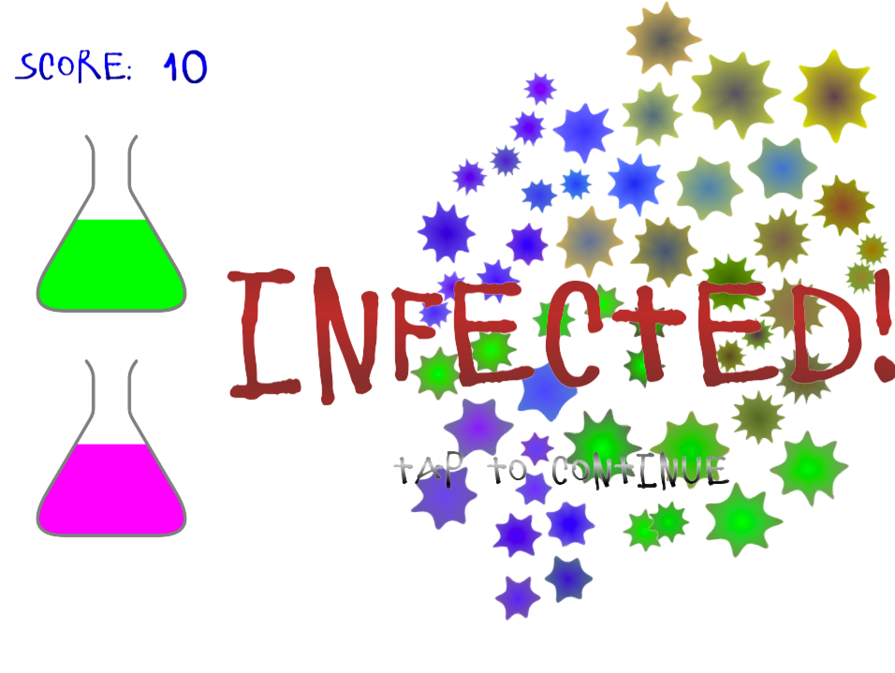
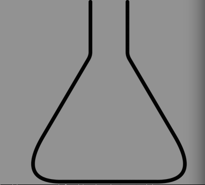
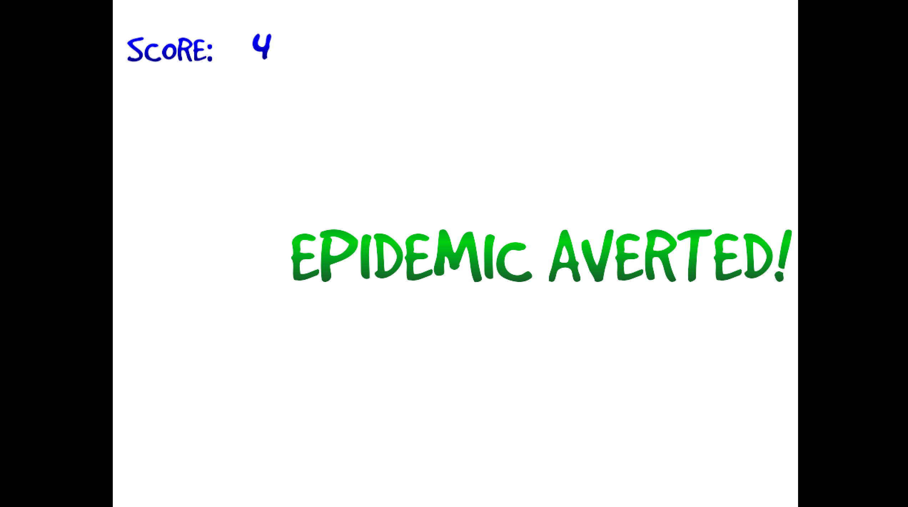
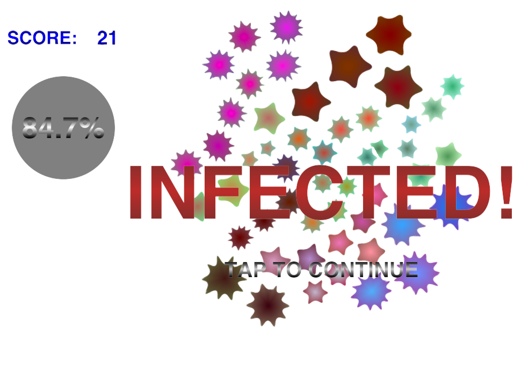
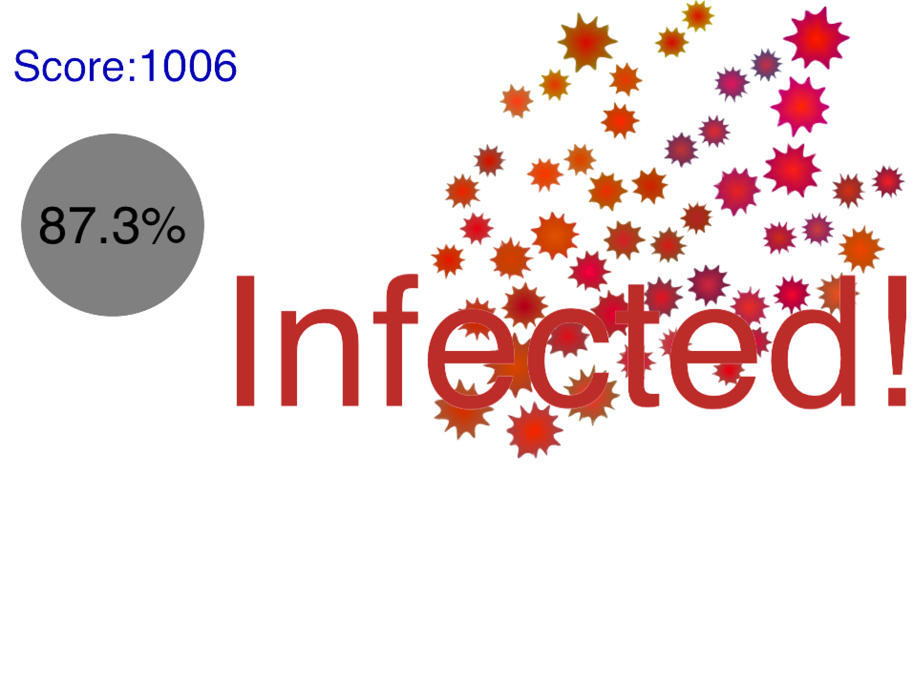
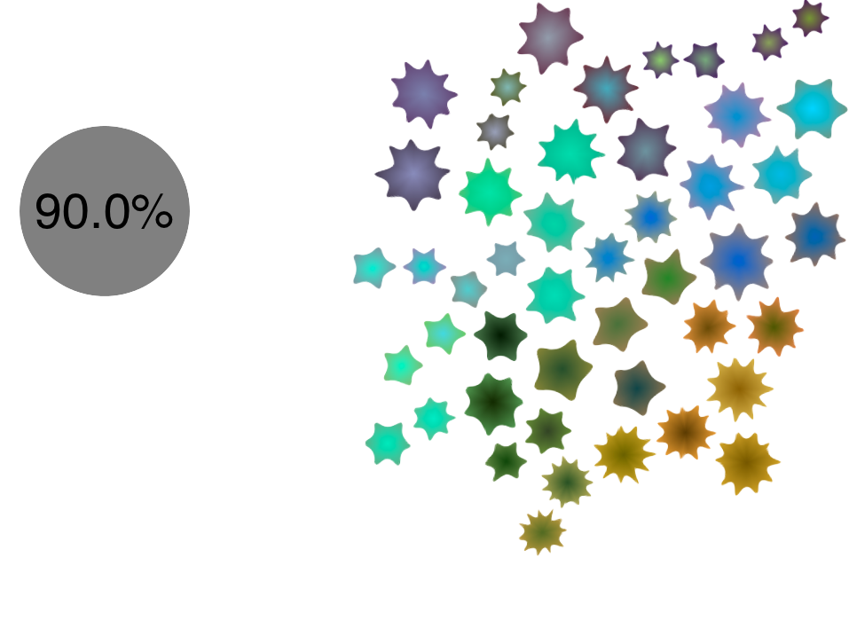
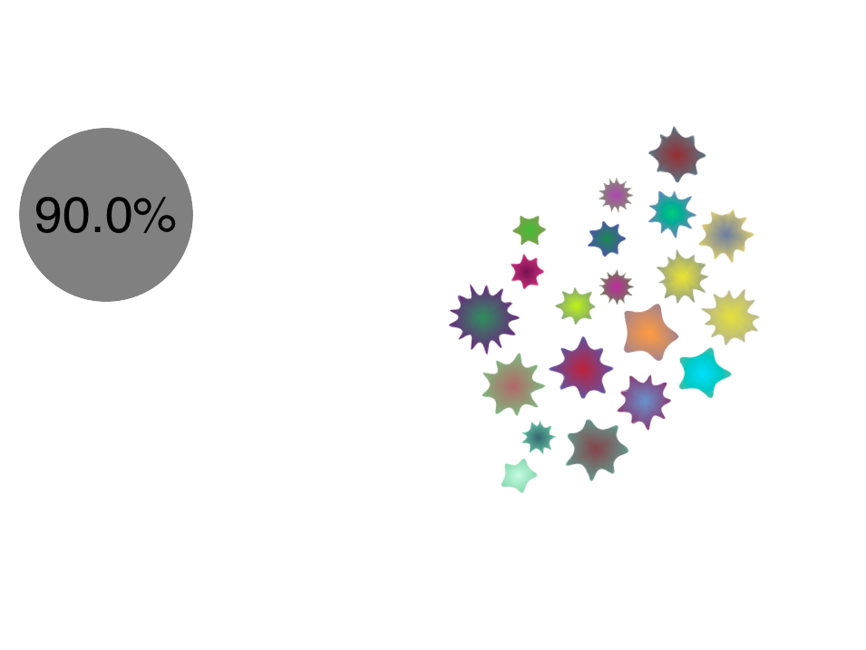
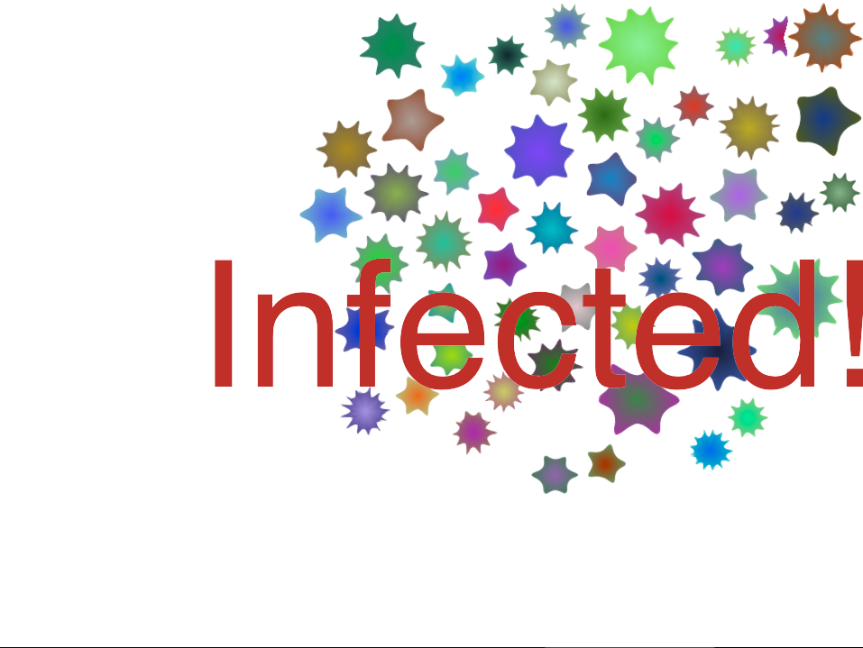

# Design Log

## Introduction

This directory contains screen shots. I explain each shot and the design decisions behind it here.

It's in reverse order so you might want to scroll down to the bottom to see how the game looked
at the beginning.

## *2015-03-01* Increased birth rate of germs

It was possible to "game" the game by killing off all germs but one and then just killing its
child as soon as it was born. You could get an unlimited score this way. I have now changed
the mechanics of the game to prevent this from being a viable strategy. The germs now increase
their birth rate as their generation increases.

You can watch a video of this [here](https://www.youtube.com/watch?v=x8anPTr0C88).

<iframe id="ytplayer" type="text/html" width="640" height="390"
  src="http://www.youtube.com/embed/x8anPTr0C88"
  frameborder="0"/>

## *2015-02-28* Antibiotic flasks add to game

**Git commit:** f7e2bff0f7ec0711fcac979bb0d3592993a3bb08

## *2015-02-26* Antibiotic flasks

**Git commit:** 723fd72027f255b7e2bc1bae21eee0f72a659568

Wrote some code to draw the antibiotic flask. Here's an evolution of my work over the last 30 minutes.

## *2015-02-01* Better fonts

**Git commit**: 3cd835552d994bcf95e930cdc568a5d1b74bae66

## *2015-01-28* True Type fonts with Freetype 2

**Git commit**: 29bcb7b7a58417ea2ff33a4aa9e692b606c6de7a

## *2015-01-25* Gradient

**Git commit**: eaa5f33065a1e4eb0da51215ef4e201fe02b5841

Gradients to text added. "Tap to continue" message added. This appears a small time after
the "Epidemic averted!" or "Infected!" message so that people don't inadvertently tap into the
next level without seeing that they completed a level or died.

## *2015-01-24* Score

**Git commit**: 42cc56818e663d36ddc45e273807850571e6e794

Score has been added.

## *2015-01-22* Mutation

**Git commit**: 68565a0be335d4e65fd55485acb9c994846f246e

The germs now mutate and inherit from each other.

## *2015-01-21* Antibiotics

**Git commit**: f7c29d8e5c1d55e9ec51ed626dfbc12bad2d6d6e

The antibiotics are shown as a big circle with an "effectiveness" written inside them.
The term "x% effective" means that *on average* x% of the germs die. What this really means
is that each germ has a small chance, equal to (100 - x)%, of being immune to the antibiotic.

At the moment you click on the antibiotic to use it. In future I will require a drag-and-drop
action in order to use. I am still undecided about whether the antibiotics applies to all the germs
or an area of effect based on where it was dropped. Probably the former as the latter has
implications for strategy and design. The implication on design is that I'll have to signify
somehow the area of effect.

## *2015-01-11* Letter boxing

**Git commit**: 44d5b8315bd330f4a22afe0e7b8dc3a2cc8a1647

The game field is now a 4:3 aspect ratio. On most mobile devices this will mean letterboxing
at the left and right of the screen. For those rare devices that have more square screens this will
mean letterboxing at the top and bottom. So I'm not using some of the screen real estate. I don't
know whether this is stupid or not, but providing a larger playing area on certain devices
just because they have a larger aspect ratio means that you have a distinct gameplay experience
(and probably an advantage over those playing on devices with a smaller aspect ratio).

The game area is divided into a *side bar* and a *game field*. The side bar takes up 1/3 of the 4:3
aspect ratio and the game field takes up the remaining 3/3. This makes the side bar big enough
to contain the antibiotics that players will unlock while provide a square game field.

You'll notice in the pic that the "Infected!" message only covers the game field. I might
change this in the future.

